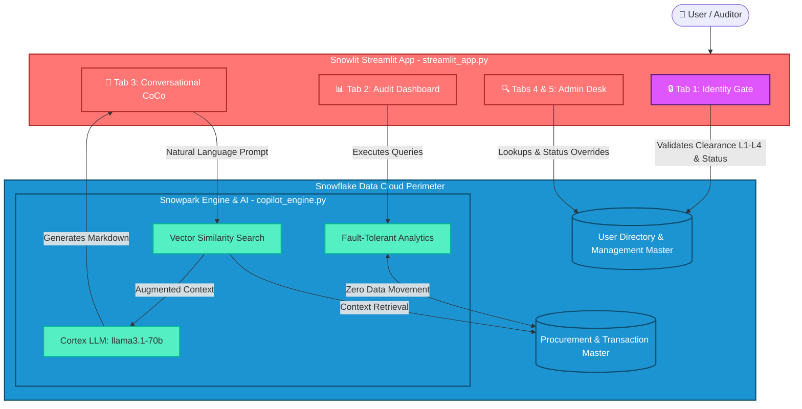

# 🛡️ Risk & Fraud Copilot Workspace | Team SnowShield

An AI-native procurement fraud and velocity detection platform built 100% inside the Snowflake Data Cloud using a zero-data-movement architecture. Developed natively via Snowlit, it eliminates data leakage risks by keeping all financial processing within the secure database perimeter.

## 🚀 Live Submission Links
* **🎬 Walkthrough Video:** [PASTE YOUR GOOGLE DRIVE/YOUTUBE LINK HERE]
* **❄️ Native App Listing:** [PASTE YOUR SNOWFLAKE DEPLOYED APP LINK HERE]

## 🏗️ Technical Architecture
* **🔒 Tab 1: Identity Gate:** Dynamic Level 1–4 role-locking (`L1_BASIC` to `L4_FULL_ACCESS`) matching live user records.
* **📊 Tab 2: Audit Dashboard:** Fault-tolerant Snowpark analytics with typecast fallback guards for 100% uptime.
* **💬 Tab 3: Conversational CoCo:** RAG engine using `VECTOR_COSINE_SIMILARITY` and `llama3.1-70b` for instant markdown STR reports.
* **🔍 Tab 4 & 🔐 5: Admin Desk:** Account lookup and real-time status overrides.



---

## 👥 Role Matrix & Access Hierarchy

The application enforces strict **Role-Based Access Control (RBAC)** pulled dynamically from the `User Directory & Management` master data grid:

| Role | Clearance Level | Sample Users | System Privileges |
| :--- | :--- | :--- | :--- |
| **JUNIOR_CLERK** | `L1_BASIC` | Ravi Menon (`jclerk01`) | Read-only access to standard operational metrics. |
| **COMPLIANCE_OFFICER** | `L2_ELEVATED` | Meera Iyer (`cofficer01`) | Review basic audit runs and trigger compliance checks. |
| **PRINCIPAL_PCO** | `L3_RESTRICTED` | Arjun Deshmukh (`ppco01`) | Full analytical evaluation + interact with Conversational CoCo. |
| **SYSTEM_ADMIN** | `L4_FULL_ACCESS` | Appala Srinivas Tanakala (`sysadmin01`) | Complete administrative desk management and user status overrides. |

---

## 🛠️ Installation & Deployment

Follow these steps to configure the secure database perimeter and launch the workspace in your Snowflake account:

### 1. Execute Environment Setup
Run the contents of `setup.sql` within a Snowflake Worksheet (using a role with `ACCOUNTADMIN` or sufficient database creation privileges) to build your foundational schema and populate the user directory:

```sql
-- Create database and schema perimeters
CREATE DATABASE IF NOT EXISTS FRAUD_COPILOT_DB;
CREATE SCHEMA IF NOT EXISTS FRAUD_COPILOT_DB.WORKSPACE;

-- [Paste remaining table setups, variables, and insert queries from your setup.sql here]
```

### 2. Configure Dependencies
Ensure your environment satisfies the library versions specified in `requirements.txt`. If deploying via Snowflake Native Apps or Stage execution, ensure these packages are selected in your environment configuration:
* `streamlit`
* `snowflake-snowpark-python`
* `snowflake-ml-python` (if utilizing native vector/Cortex extensions)

### 3. Deploy the Streamlit Application
1. Navigate to **Projects** ➡️ **Streamlit** inside your Snowflake UI.
2. Create a new Streamlit app, referencing `FRAUD_COPILOT_DB.WORKSPACE`.
3. Replace the entry point code with `streamlit_app.py`.
4. Upload `copilot_engine.py` as an auxiliary module in the application stage directory.
