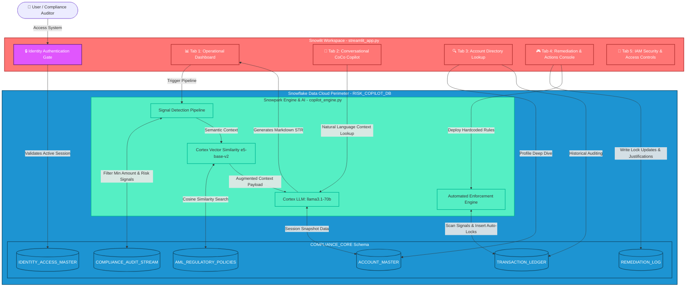

# 🛡️ Risk & Fraud Copilot Workspace | Team SnowShield

An AI-native procurement fraud and velocity detection platform built 100% inside the **Snowflake Data Cloud** using a zero-data-movement architecture. Developed natively via **Snowlit**, this solution completely eliminates data exfiltration and leakage vectors by keeping all data parsing, regulatory vector matching, and LLM text generation entirely within your secure database perimeter.

## 🚀 Live Submission Links
* **🎬 Walkthrough Video:** [PASTE YOUR GOOGLE DRIVE/YOUTUBE LINK HERE]
* **❄️ Native App Listing:** [PASTE YOUR SNOWFLAKE DEPLOYED APP LINK HERE]

---

## 🏗️ Technical Architecture & Data Flow

The architecture operates strictly inside the **Snowflake Data Cloud Perimeter** (`RISK_COPILOT_DB`). The frontend interface uses granular role-locking, routing session states through active user master data records before granting analytical or action capabilities.



---

## 👥 Role Matrix & Access Hierarchy

The application maps specific interfaces dynamically based on the verified `CLEARANCE_LEVEL` row entry assigned to the user:

| Role | Clearance Level | Permitted Views & Actions | System Restrictions |
| :--- | :--- | :--- | :--- |
| **JUNIOR_CLERK** | `L1_BASIC` | View basic operational dashboard metrics & active anomalies. | Cannot query CoCo, view detailed profiles, lock accounts, or manage users. |
| **COMPLIANCE_OFFICER** | `L2_ELEVATED` | Operational Dashboard + Conversational CoCo room chat + Customer 360 lookup. | Blocked from executing manual remediations, auto-rules, or IAM adjustments. |
| **PRINCIPAL_PCO** | `L3_RESTRICTED` | All functional views + Execute manual containment protocols + Deploy automated rules. | Restricted from adding/managing system users or altering system clearancies. |
| **SYSTEM_ADMIN** | `L4_FULL_ACCESS` | Complete system access. Manage IAM table, append records, toggle user activity statuses. | *None — Unrestricted Account Administrator Access*. |

---

## ⚙️ Core Workspace Modules

### 📊 Tab 1: Operational Dashboard
Runs a multi-tier risk calculation pipeline powered by Snowpark analytics:
1. **Signal Detection:** Filters out anomalous files from `COMPLIANCE_AUDIT_STREAM` based on an interactive cross-border amount slider, matching high-impact criteria (`IS_PEP`, suspended flags, velocity warnings). 
2. **Dynamic Risk Scoring:** Programmatically builds a real-time risk profile using geographic target parameters (e.g., scoring adjustments for tax havens like `CH` or `KY`).
3. **Semantic Policy Extraction:** Executes a native Snowflake `VECTOR_COSINE_SIMILARITY` search querying `AML_REGULATORY_POLICIES` using the `e5-base-v2` embedding engine to surface matching legal context.
4. **Automated STR Assembly:** Pipelines structured data and unstructured legal fragments directly into Cortex `llama3.1-70b` to build a production-grade markdown Suspicious Transaction Report (STR) complete with metric summary cards and charts.

### 💬 Tab 2: Conversational CoCo Copilot
An interactive natural language compliance assistant. CoCo matches account mentions (e.g., searching for numeric patterns or strings like `ACC_101`) to parse details out of the customer master layout instantly. If specific key phrases regarding "status" or "locks" are queried, CoCo references active states from the remediation log; general compliance prompts route out to a context-augmented Cortex LLM engine.

### 🔍 Tab 3: Account Directory Lookup
Exposes a comprehensive Customer 360 profile registry. System users can browse demographic parameters, PAN numbers, Import Export Code (IEC) fields, GSTIN registrations, and historical transactional logs from the `TRANSACTION_LEDGER`. *Security Guard: If an account is currently marked with an `ACTIVE_LOCK`, transaction histories are automatically masked to preserve audit integrity.*

### 🎮 Tab 4: Remediation & Actions Console
Allows direct database containment enforcement. Modifying an active account protocol to an unlocked state requires a mandatory compliance rationale and file upload attachment (PDF/images), appending audit traces directly to `REMEDIATION_LOG`. Includes the **Automated Data Engine Rules** runner which programmatically audits the workspace and processes system locks for high-risk targets:
* **Rule 1 (Sanctioned Country Auto-Freeze):** Immediate account lockdown if capital routes to `KP`, `IR`, `SY`, or `MM`.
* **Rule 2 (PEP Tax Haven Lock):** Immediate lockdown and `ENHANCED_EDD` escalation if a Politically Exposed Person transfers funds to `KY` or `CH`.

### 🔐 Tab 5: IAM Security & Access Controls
A secure simulator panel displaying active clearance configurations. When accessed by an `L4_FULL_ACCESS` administrator, it unlocks database insertion wrappers to register new users with `SHA2` password hashes or toggle live operational access statuses.

---

## 🛠️ Data Infrastructure Setup & Installation

### 1. Database & Schema Initialization
Execute this structural layout inside a Snowflake Worksheet to construct the database perimeter and core tables required by the Snowpark engine:

```sql
-- Create Secure Database Perimeter
CREATE DATABASE RISK_COPILOT_DB;
USE DATABASE RISK_COPILOT_DB;

CREATE SCHEMA COMPLIANCE_CORE;
USE SCHEMA COMPLIANCE_CORE;

-- Create Identity & Access Control Ledger
CREATE TABLE IDENTITY_ACCESS_MASTER (
    USER_ID INT IDENTITY(1,1),
    USERNAME VARCHAR(50) UNIQUE NOT NULL,
    DISPLAY_NAME VARCHAR(100),
    PASSWORD_HASH VARCHAR(64),
    ACCESS_ROLE VARCHAR(50),
    CLEARANCE_LEVEL VARCHAR(30),
    DEPARTMENT VARCHAR(100),
    IS_ACTIVE BOOLEAN DEFAULT TRUE,
    LAST_LOGIN TIMESTAMP_NTZ,
    CREATED_AT TIMESTAMP_NTZ DEFAULT CURRENT_TIMESTAMP()
);

-- Create Remediation Log Matrix
CREATE TABLE REMEDIATION_LOG (
    LOG_ID INT IDENTITY(1,1),
    ACCOUNT_ID VARCHAR(50),
    SYSTEMIC_LOCK_STATUS VARCHAR(30),
    OUTBOUND_OVERRIDE_ENABLED BOOLEAN,
    KYC_STEP_UP_LEVEL VARCHAR(30),
    COMPLIANCE_REMARKS TEXT,
    DOCUMENT_REFERENCE VARCHAR(255),
    UPDATED_BY VARCHAR(100),
    UPDATED_AT TIMESTAMP_NTZ DEFAULT CURRENT_TIMESTAMP()
);

-- Seed Initial System Administrator Account (Password: Admin123)
INSERT INTO IDENTITY_ACCESS_MASTER (USERNAME, DISPLAY_NAME, PASSWORD_HASH, ACCESS_ROLE, CLEARANCE_LEVEL, DEPARTMENT)
VALUES ('sysadmin01', 'Appala Srinivas Tanakala', SHA2('Admin123'), 'SYSTEM_ADMIN', 'L4_FULL_ACCESS', 'IT Security & Infrastructure');

-- [Execute remaining structural tables: ACCOUNT_MASTER, TRANSACTION_LEDGER, COMPLIANCE_AUDIT_STREAM, AML_REGULATORY_POLICIES]
```

### 2. Package Dependency Configuration
Verify that your Snowflake Streamlit environment includes the core configurations declared in `requirements.txt`:
```text
streamlit
pandas
altair
snowflake-snowpark-python
```
